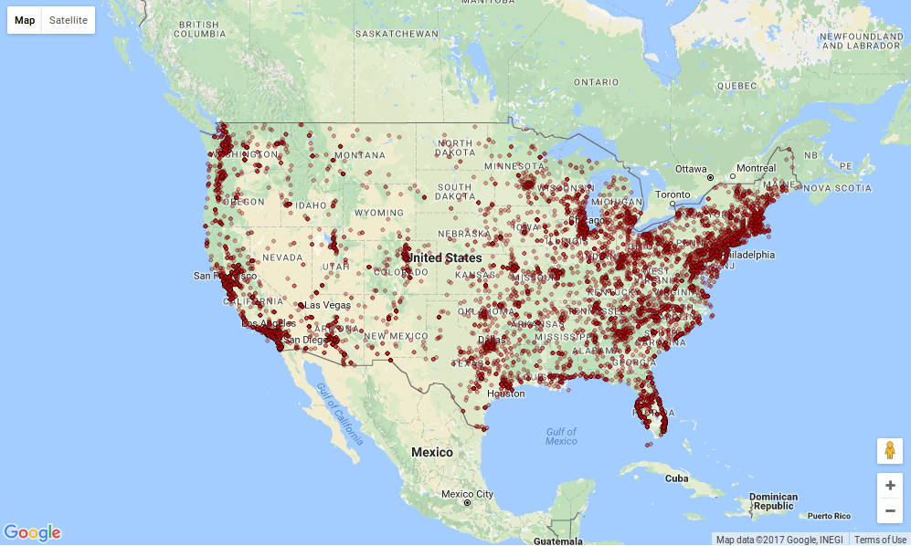

# UFOvis
Visualization of UFO sightings across the USA, using a combo of d3 and Google Maps API. Work In Progress.
Source of data: https://www.kaggle.com/NUFORC/ufo-sightings, "scrubbed.csv" specifically, converted to json with csvToJson.py.
Shoutout to the famous Mike Bostock for his very helpful bl.ock at https://bl.ocks.org/mbostock/899711.

